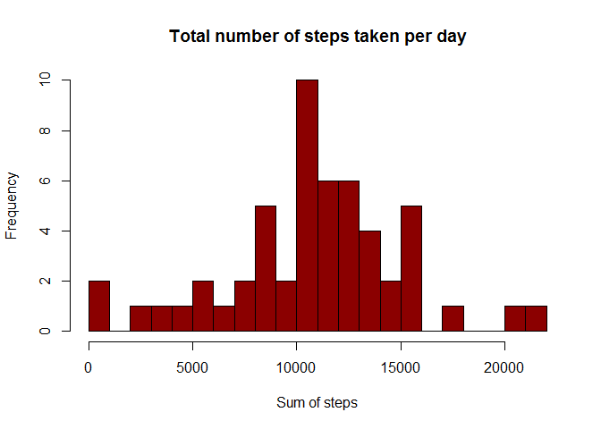
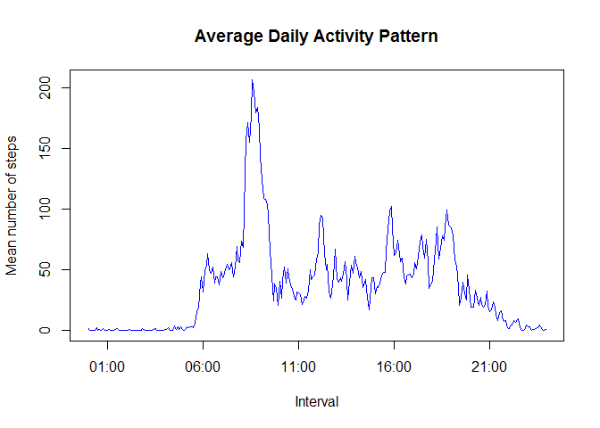
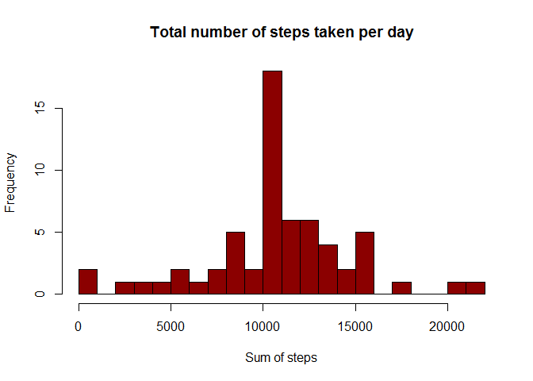
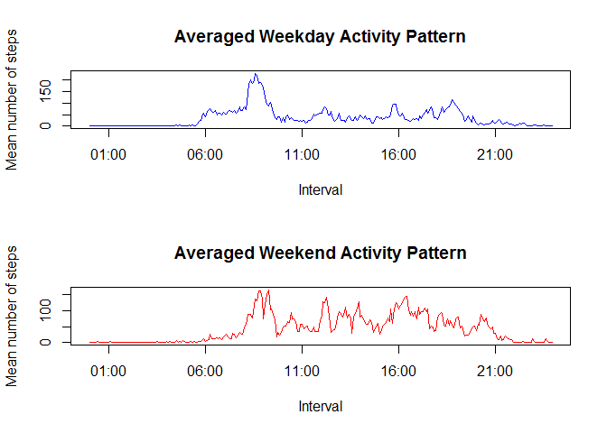

# Reproducible Research: Peer Assessment 1

### setup the timezone

```r
Sys.setlocale("LC_ALL", "English")
```

```
## [1] "LC_COLLATE=English_United States.1252;LC_CTYPE=English_United States.1252;LC_MONETARY=English_United States.1252;LC_NUMERIC=C;LC_TIME=English_United States.1252"
```

###Load the packages needed:

```r
library(lubridate)
library(dplyr)
```

```
## 
## Attaching package: 'dplyr'
## 
## The following objects are masked from 'package:lubridate':
## 
##     intersect, setdiff, union
## 
## The following object is masked from 'package:stats':
## 
##     filter
## 
## The following objects are masked from 'package:base':
## 
##     intersect, setdiff, setequal, union
```

## Loading and preprocessing the data

###Load activity data

```r
act<-read.csv("activity.csv")
```


## What is mean total number of steps taken per day?
### 1. Calculate the total number of steps taken per day

```r
act2<-act%>%group_by(date)%>%summarise(TotalStep=sum(steps))
act2
```

```
## Source: local data frame [61 x 2]
## 
##          date TotalStep
## 1  2012-10-01        NA
## 2  2012-10-02       126
## 3  2012-10-03     11352
## 4  2012-10-04     12116
## 5  2012-10-05     13294
## 6  2012-10-06     15420
## 7  2012-10-07     11015
## 8  2012-10-08        NA
## 9  2012-10-09     12811
## 10 2012-10-10      9900
## ..        ...       ...
```

### 2.Make a histogram of the total number of steps taken each day

```r
rmna.act2<-act2[complete.cases(act2),]     ## remove NA rows
hist(rmna.act2$TotalStep,main="Total number of steps taken per day",xlab="Sum of steps",breaks=20,col="Dark Red")
```

 

### 3. Calculate and report the mean and median of the total number of steps taken per day

```r
summary(act2$TotalStep)
```

```
##    Min. 1st Qu.  Median    Mean 3rd Qu.    Max.    NA's 
##      41    8841   10760   10770   13290   21190       8
```


## What is the average daily activity pattern?
### 1. Make a time series plot of the 5-minute interval (x-axis) and the average number of steps taken, averaged across all days (y-axis)

```r
act3=mutate(act,interval=sprintf("%04d",interval)) ##make 5 to 0005
act3$interval=paste(substr(act3$interval,1,2),substr(act3$interval,3,4), sep=":") ## make HHMM to HH:MM
meanact3<-act3%>%group_by(interval)%>%summarise(meanstep=mean(steps,na.rm=TRUE))  ## calculate the mean
meanact3$interval=strptime(meanact3$interval,"%H:%M")     ##convert character to POSIXLt
plot(meanact3,type="l",xlab="Interval",ylab="Mean number of steps", main="Average Daily Activity Pattern",col="BLUE")
```

 

### 2. The maximum number of steps of all 5-minute interval

```r
meanact3$interval[meanact3$meanstep==max(meanact3$meanstep)]
```

```
## [1] "2015-05-18 08:35:00 CST"
```


## Imputing missing values
### 1. Calculate and report the total number of missing values in the dataset

```r
sum(is.na(act$steps))
```

```
## [1] 2304
```

### 2. Filling in all of the missing values in the dataset

```r
fillna<-act3
fillna$meanstep=rep(meanact3$meanstep,61)     ##Add meanstep to table
my.na<-is.na(fillna$steps)
fillna$steps[my.na]<-fillna$meanstep[my.na]  ## fill NA with meanstep per day
fillna$meanstep<-NULL  ## remove the column
head(fillna)     ## Showing the head of table
```

```
##       steps       date interval
## 1 1.7169811 2012-10-01    00:00
## 2 0.3396226 2012-10-01    00:05
## 3 0.1320755 2012-10-01    00:10
## 4 0.1509434 2012-10-01    00:15
## 5 0.0754717 2012-10-01    00:20
## 6 2.0943396 2012-10-01    00:25
```

### 3. Make a histogram of the total number of steps taken each day (NAs were filled with the mean steps of 5-min interval per day)

```r
act4<-fillna%>%group_by(date)%>%summarise(TotalStep=sum(steps))
hist(act4$TotalStep,main="Total number of steps taken per day",xlab="Sum of steps",breaks=20,col="Dark Red")
```

 

### 4. Calculate and report the mean and median total number of steps taken per day

```r
summary(act4$TotalStep)
```

```
##    Min. 1st Qu.  Median    Mean 3rd Qu.    Max. 
##      41    9819   10770   10770   12810   21190
```


## Are there differences in activity patterns between weekdays and weekends?
### 1. Create a new factor variable with “weekday” and “weekend”

```r
act5<-fillna[1:3]
act5$wday<-weekdays(as.Date(act5$date))
weekday<-c("Monday","Tuesday","Wednesday","Thursday","Friday")
weekend<-c("Saturday","Sunday")
act5$wday[act5$wday%in%weekday]<-"weekday"   ## Replace Mon. to Fri. with "weekday"
act5$wday[act5$wday%in%weekend]<-"weekend"   ## Replace Sat. and Sun. with "weekend"
head(act5)   ## Showing the head of table
```

```
##       steps       date interval    wday
## 1 1.7169811 2012-10-01    00:00 weekday
## 2 0.3396226 2012-10-01    00:05 weekday
## 3 0.1320755 2012-10-01    00:10 weekday
## 4 0.1509434 2012-10-01    00:15 weekday
## 5 0.0754717 2012-10-01    00:20 weekday
## 6 2.0943396 2012-10-01    00:25 weekday
```

### 2. Make a panel plot

```r
wky<-act5[act5$wday=="weekday",]
wkd<-act5[act5$wday=="weekend",]
mwky<-wky%>%group_by(interval)%>%summarise(meanstep=mean(steps))
mwkd<-wkd%>%group_by(interval)%>%summarise(meanstep=mean(steps))
mwky$interval=strptime(mwky$interval,"%H:%M")     ##convert character to POSIXLt
mwkd$interval=strptime(mwkd$interval,"%H:%M")     ##convert character to POSIXLt
par(mfrow=c(2,1))
plot(mwky,type="l",xlab="Interval",ylab="Mean number of steps", main="Averaged Weekday Activity Pattern",col="BLUE")
plot(mwkd,type="l",xlab="Interval",ylab="Mean number of steps", main="Averaged Weekend Activity Pattern",col="Red")
```

 
